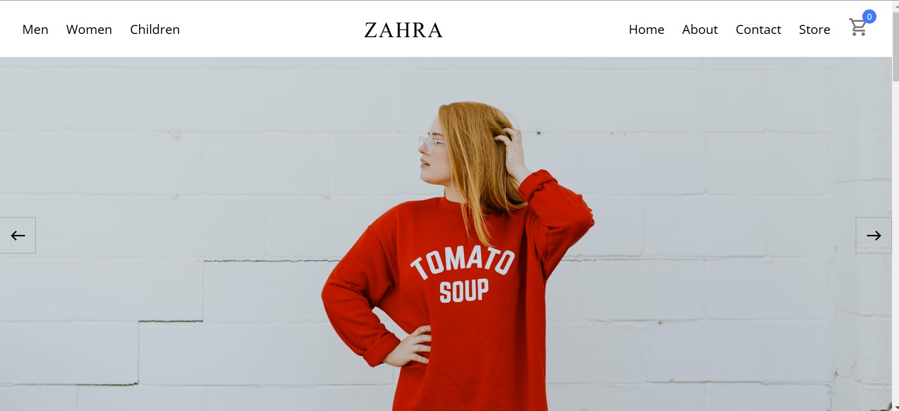

   
   
  

    E-commerce-Clothing-Store is an online platform for shopping clothing items. Built with React, Strapi CMS, SCSS, Redux Toolkit, and Axios, it provides a seamless shopping experience with dynamic content, powerful filtering options, and a feature-rich shopping cart.   
  

 

## 💻 Technology Used

**React**: Front-end library for building user interfaces.
**Strapi CMS** Headless CMS for managing dynamic content.
**SCSS**: CSS preprocessor for modular and maintainable styles.
**Redux Toolkit**: State management solution for efficient app-wide data handling.
**Axios**: Promise-based HTTP client for API requests.

## Features

Dynamic Content from Strapi CMS:

All products, images and categories are dynamically fetched from Strapi CMS, enabling easy updates and management.
Filtering Options:

Filter products by category and price range for a personalized shopping experience.
Shopping Cart:

Add products to the cart, manage quantities, and proceed to checkout.

## Screenshots

## Screenshots

 
 

 
 

 
 

 
 

 
 

 
